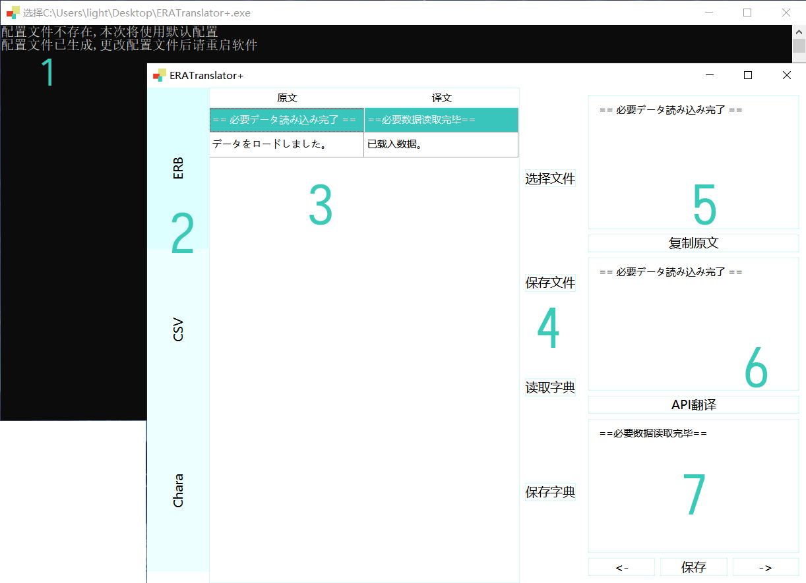

# EraTranslatorPlus

这是一个**Era游戏**的翻译器<br>
你可以用它来翻译**Era游戏**的**ERB文件**、**CSV文件**和**角色名字**<br>
目前它还不够完善,欢迎反馈BUG、提出改进措施

main分支使用**Python3.9**、**PySide6**, Windows10<br>
compatible分支使用**Python3.8**、**PySide2**, 向下兼容至Windows7 SP1

两个分支代码基本一致

## 目录

- [EraTranslatorPlus](#eratranslatorplus)
  - [目录](#目录)
  - [背景](#背景)
  - [下载](#下载)
  - [使用说明](#使用说明)
      - [界面](#界面)
      - [功能](#功能)
      - [*Config配置参数*](#config配置参数)
  - [Todo](#todo)

## 背景

因为没有足够完善的ERA翻译器，所以我决定写一个自己用，顺便练习Qt

UI界面模仿[](https://github.com/mammothrider/ERATranslateHelper)<br>
UI风格模仿[](https://github.com/liaokongVFX/QFlat)<br>

## 下载

<del>深渊研发中心</del>(尚未发布)或[release](https://github.com/trlaitioer/EraTranslatorPlus/releases)

## 使用说明

#### 界面



1. 命令行，会输出一些报错/提示信息
2. 选项卡，切换ERB/CSV/角色翻译界面，三个界面基本一致
3. 显示需要翻译的文本与翻译后的文本
4. 一些按钮，读取/保存字典尚未实现
5. **原文**(不可更改)
6. 用于编辑的文本框，**API翻译的原文**
7. API翻译后会替换该文本框的原先内容，保存时此处文本为**译文**

#### 功能

* ERB、CSV文件需要分别对应存放在ERB、CSV目录下
* 翻译角色名字时选择CSV文件夹，ERB和CSV则选择需要翻译的文件
* 会在游戏目录下生成cache缓存目录，记录已经翻译的内容对应的原文，功能相当于ERATranslator的Mark，json格式


#### *Config配置参数*

* ***Setting***

```
[Setting]
API = BaiduAPI
```
目前只有百度API可以用，后续可能会加入其他API

可以置空，则不会使用任何API

* ***BaiduAPI***

```
[BaiduAPI]
appid =
key =
from = auto
to = zh
```

appid与key填百度API账号<br>
from原文语种<br>
to目标语种

具体可选参数请看百度API文档

* ***SystemCSV***

```
[SystemCSV]
ABL = Abl.csv
BASE = Base.csv
CFLAG = CFlag.csv
(余下省略)
```

可以自己添加，键值随意

只有添加在此处的CSV可被翻译

对CSV的具体识别修改方式见接下来的其他参数

* ***ERBMatch***

```
[ERBMatch]
0 = PRINT\S*\s+\[[\d\s]+\]\W*(.+)
1 = PRINT\S*\s+(.+)
2 = REUSELASTLINE\s+(.+)
```

识别ERB中需要翻译内容的正则表达式，格式请参考Python的re模块，需要翻译的部分用英文括号括起

* ***CSVMatch***

```
[CSVMatch]
1 = \d+\s*,\s*([^\s,;]+)
```

识别CSV中需要翻译内容的正则表达式，格式同上

* ***CSVMatchERB***

```
[CSVMatchERB]
1 = %Attr%\s*:[^\s*/+-]+?:\s*([^\s,:;(){}|&*/+-]+)
2 = %Attr%\s*:\s*([^\s,:;(){}|&*/+-]+)
```

识别CSV中需要翻译内容在ERB中格式的正则表达式，格式同上

%Attr%参数为翻译的文件名(不包括后缀，大写)

* ***CSVMatchChara***

```
[CSVMatchChara]
1 = ^[^\s,;]+\s*,\s*([^\s,;]+)\s*,
2 = ^[^\s,;]+\s*,\s*([^\s,;]+)
```

识别CSV中需要翻译内容在角色CSV文件中格式的正则表达式，格式同上

* ***CharaMatch***

```
[CharaMatch]
1 = 名前\s*,\s*([^,;\n\r]+)
2 = 呼び名\s*,\s*([^,;\n\r]+)
3 = CSTR\s*,\s*CHARA_RENAME\s*,\s*([^,;\n\r]+)
```

识别角色CSV文件(chara*.csv)中需要翻译名字的正则表达式，格式同上

## Todo

* cache转字典
* 字典读取/保存
* 优化代码结构，加快程序运行速度
